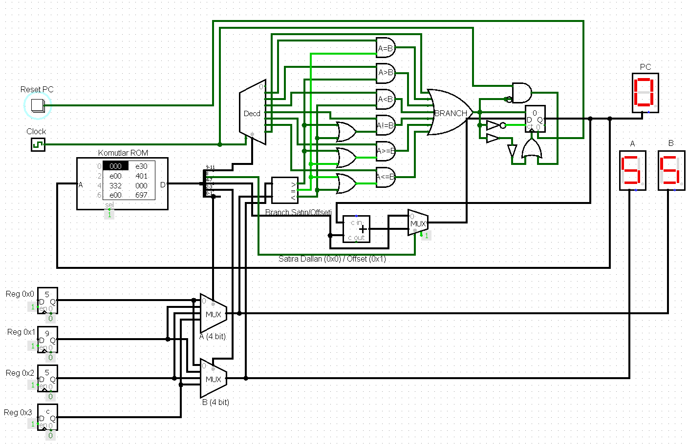
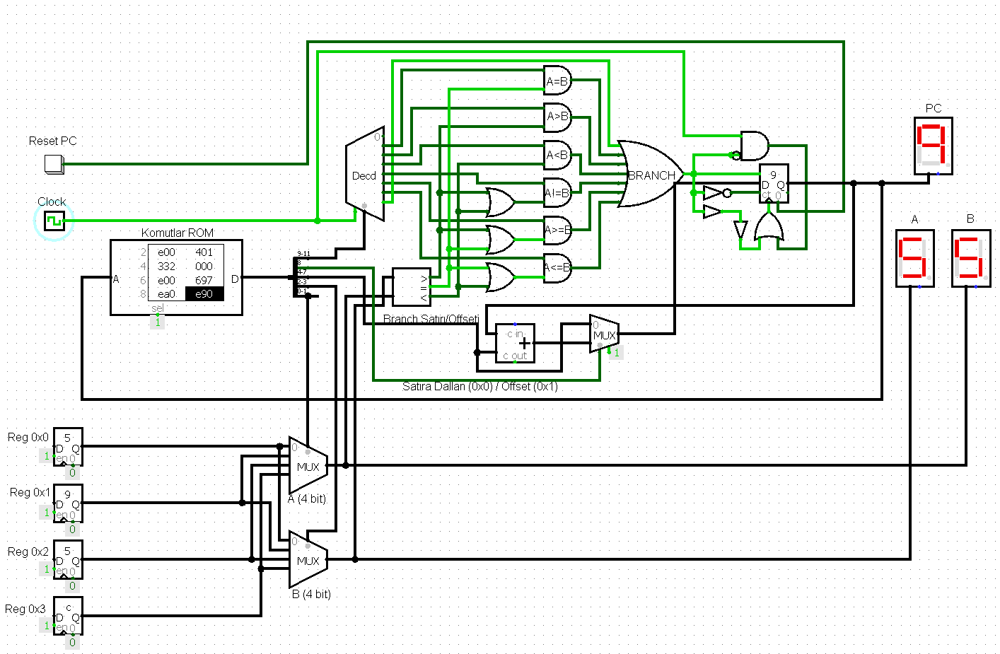

# 4-Bit Branching Datapath Project

This project implements a **4-bit datapath with conditional branching logic** using **Logisim**. It features a custom 12-bit Instruction Set Architecture (ISA) designed to compare register values and control program flow based on specific conditions.

The design operates as a **single-cycle** architecture, performing fetch, decode, and execute operations within a single clock pulse.

---

## Overview
The primary goal of this project is to demonstrate how a processor handles control flow operations. The datapath reads instructions from a ROM, compares values stored in a register file, and updates the Program Counter (PC) to jump to absolute addresses or apply relative offsets.

*(Overview of the Logisim solution)*

---

## Instruction Format (12-Bit)

The instruction set is 12 bits wide, stored in ROM, and represented by 3 hexadecimal digits.

| Bit Range | Field | Description |
| :--- | :--- | :--- |
| **[11, 9]** | **OP (Opcode)** | The operation code (e.g., BEQ, BGT). |
| **8** | **MODE** | Selects between Absolute Address (0) or Relative Offset (1). |
| **[7, 4]** | **TARGET/OFFSET** | The target address to jump to or the offset value to add. |
| **[3, 2]** | **REG A** | Address of the first source register. |
| **[1, 0]** | **REG B** | Address of the second source register. |

### Register File
The system utilizes 4 registers (4-bits each), addressed from `0x0` to `0x3`.

---

## Instruction Set Architecture

The datapath supports 6 conditional branching instructions, along with NOP and unconditional JMP.

| Mnemonic | Opcode (Bin) | Logic | Description |
| :--- | :--- | :--- | :--- |
| **NOP** | `000` | - | No Operation; proceed to next line. |
| **BEQ** | `001` | $A = B$ | Branch if A equals B. |
| **BGT** | `010` | $A > B$ | Branch if A is greater than B. |
| **BLT** | `011` | $A < B$ | Branch if A is less than B. |
| **BNE** | `100` | $A \neq B$ | Branch if A is not equal to B. |
| **BGE** | `101` | $A \ge B$ | Branch if A is greater than or equal to B. |
| **BLE** | `110` | $A \le B$ | Branch if A is less than or equal to B. |
| **JMP** | `111` | `1` | Unconditional Jump. |

### Addressing Modes (Bit 8)
The **Mode Bit** determines how the PC is updated when a branch is taken.

* **Mode 0 (Absolute):** The PC is set directly to the value in the `Target` field (e.g., Go to line 10).
* **Mode 1 (Relative):** The value in the `Offset` field is added to the current PC.

> **Backward Jumps:** To jump backward using offsets, the system uses an overflow method: `Current Line + Max Line (15) - Target Line`. For example, to go back 1 line from line 10, the calculation is $10 + (15-1) = 24$. Due to 4-bit wrap-around, this results in line 9.

---

## Simulation and Testing

To verify the design, a specific test program was loaded into the ROM.

**Initial Register Values:**
* `R0`: `0x5`
* `R1`: `0x9`
* `R2`: `0x5`
* `R3`: `0xC`

### Test Program (Assembly)

| Line | Assembly | Hex | Logic / Outcome |
| :--- | :--- | :--- | :--- |
| **0x0** | `NOP` | `000` | No operation. |
| **0x1** | `JMP @0x3` | `E30` | Jump to line 3. |
| **0x2** | `JMP @0x0` | `E00` | *Skipped.* |
| **0x3** | `BGT R0, R1, @0x0` | `401` | Is $5 > 9$? **No**. Continue. |
| **0x4** | `BEQ R0, R2, #3` | `332` | Is $5 = 5$? **Yes**. Add offset 3 ($PC+3 \rightarrow 7$). |
| **0x5** | `NOP` | `000` | *Skipped.* |
| **0x6** | `JMP @0x0` | `E00` | *Skipped.* |
| **0x7** | `BLT R1, R3, @0x9` | `697` | Is $9 < 12$? **Yes**. Jump to line 9. |
| **0x8** | `JMP @0xA` | `EA0` | *Skipped.* |
| **0x9** | `JMP @0x9` | `E90` | **Infinite Loop** (Program ends here). |
| **0xA** | `JMP @0xA` | `EA0`| *Skipped.* |

*(Flowchart of the test scenario)*

### Results
The simulation successfully followed the expected path (indicated by the red arrow in the flowchart) and entered the infinite loop at line `0x9`. The design correctly handles fetch, decode, and execute stages in a single cycle.

## Conclusion

This project successfully establishes a fast and understandable 4-bit datapath. It provides practical insights into:
1.  **Data Comparison:** comparing register values using logic gates.
2.  **Control Flow:** Understanding how Opcodes and PC manipulation work.
3.  **Architecture:** Implementing the interaction between ROM, Decoders, and the Program Counter.

## License

This project is licensed under the [MIT License](LICENSE).
